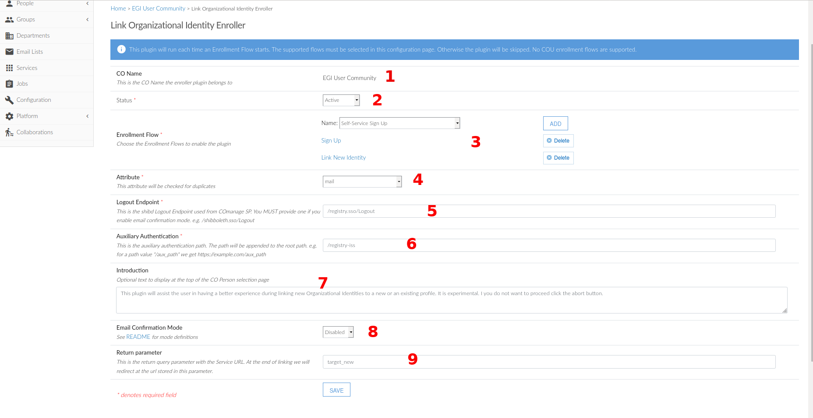

# comanage-registry-plugin-LinkOrgIdentityEnroller
This is a CakaPHP/ COmanage Enroller Plugin developed in order to facilitate both implicit and explicit Identity Linking. Currently, there are occasions where a CO Person wants to enroll to a CO and forgets that there is already an account in the registry under the same CO but with a different IdP than the one that will be used for this new attemp.  As a result the user ends up with two different accounts, and two different unique identifiers.

For the case of implicit linking, the plugin searchs the registry for any existing account of the applicant during the enrollment flow process. If an account/s is retrieved, we present them to the user and let him/her decide on how to proceed. The view will quote the accounts one by one and will expose the given and family name fields, the email address and the IdPs previously linked/correlated with this account. In order to be GDPR compliant we hide the majority of the letters that compose all the fields from above. If we find no accounts then we let the enrollment process continue its default flow.

Additionally, explicit linking is supported. A registered user that wants to link a new IdP to his account can do it by invoking the corresponding Enrollment Flow. This plugin, will make the flow more user friendly, simpler, shorter and faster thus improving the overall user experience.
Improved user enrollment and identity linking process:
- Explicit linking
- Implicit identity linking
  - Prompt user to link their identity when matching


## Installation

1. Run `git clone https://github.com/rciam/comanage-registry-plugin-LinkOrgIdentityEnroller.git /path/to/comanage/local/Plugin/LinkOrgIdentityEnroller`
2. Run `cd /path/to/comanage/app`
3. Run `Console/clearcache`
4. Run `Console/cake schema create --file schema.php --path /path/to/comanage/local/Plugin/LinkOrgIdentityEnroller/Config/Schema`


## Schema update
 
## Configuration
### Auxiliary Authtentication
In order for the plugin to handle the double authentication of the user during the explicit or the implicit linking we create a dummy authentication path named `registry-iss`. We anticipate to fetch the users attributes without logging him/her out of the COmanage session. In order for the auxiliary authentication to work we need to make publicly available the php file that implements the logic described above, under the registry-iss path. This is done by creating a symbolic link.
```bash
# Command
ln -s /path/to/comanage/local/Plugin/LinkOrgIdentityEnroller/webroot/auth/login /var/www//html/registry-iss
# The auxiliary login is now publicly available
root@comanage-server:/var/www/html/registry-iss -> /path/to/comanage/local/Plugin/LinkOrgIdentityEnroller/webroot/auth/login
```
Additionally we need to configure an extra authentication path in the shibboleth apache2 module. The configuration will look like below:
```xml
...
   <RequestMapper type="Native">
        <RequestMap applicationId="default">
            <Host name="comanage-dev.aai-dev.grnet.gr">
                <!-- I should not require a session for the Comanage login page. If i do i will be redirected to the proxy and not the auth/login url -->
                <Path name="registry" authType="shibboleth"/>
                <Path name="registry-iss" applicationId="iss" authType="shibboleth" requireSession="true"/>
            </Host>
        </RequestMap>
    </RequestMapper>
...
        <ApplicationOverride id="iss" entityID="https://comanage-dev.aai-dev.grnet.gr/registry-iss/shibboleth"
                             REMOTE_USER="eduPersonUniqueId">
            <Sessions lifetime="5"
                      timeout="5"
                      relayState="ss:db"
                      checkAddress="false"
                      handlerSSL="true"
                      cookieProps="; path=/registry-iss; secure; HttpOnly"
                      consistentAddress="false"
                      maxTimeSinceAuthn="5"
                      cookieLifetime="5"
                      handlerURL="/registry-iss/Shibboleth.sso">
                <!-- We need to force reAuthentication here -->
                <!-- Check this article: https://wiki.shibboleth.net/confluence/display/SP3/ForceAuthn -->
                <SSO entityID="https://aai-dev.egi.eu/proxy/saml2/idp/metadata.php" forceAuthn="true">SAML2</SSO>
 
                <Logout>Local</Logout>
 
                <!-- Extension service that generates "approximate" metadata based on SP configuration. -->
                <Handler type="MetadataGenerator" Location="/Metadata" signing="false"/>
 
                <!-- Status reporting service. -->
                <Handler type="Status" Location="/Status" acl="127.0.0.1 ::1"/>
 
                <!-- Session diagnostic service. -->
                <Handler type="Session" Location="/Session" showAttributeValues="true"/>
 
                <!-- JSON feed of discovery information. -->
                <Handler type="DiscoveryFeed" Location="/DiscoFeed"/>
            </Sessions>
        </ApplicationOverride>
...
```
Configure a cron job that will delete any orphan tokens created by the Plugin after the configured time interval expires
- Create the cron file
```bash
cd /etc/cron.d
vi comanage-registry
```
- Configure the action
```bash  
#Delete expired COmanage tokens from linking plugin
0 * * * * cd /opt/share/comanage-registry-rciam-3.1.x/app && Console/cake LinkOrgIdentityEnroller.state
```

### Plugin Configuration
The LinkOrgIdentityEnroller plugin can be configured only by a coadmin or a cmadmin. The first one is the administrator of the CO that the plugin is enable and the second one is the administrator of the whole Registry framework.
1. Navigate to Configuration > [Link Enroller](https://spaces.at.internet2.edu/pages/viewpage.action?pageId=87756108)
2. Configure either in Redirect Mode or in Email Confirmation Mode

#### Redirect Mode

<ol>
  <li>The friendly name of the CO we are currently configuring the plugin.
  <li>Pick Active to enable the plugin or suspended to skip it during enrollment
  <li>Pick the Enrollment Flows that you wish to apply the plugin's functionality to. Currently all the COU enrollment flows are excluded. Each Enrollment Flow is a hyperlink to it's edit view.
  <li>Pick the Attribute that will be used for account matching. Currently only the mail attribute is allowed.
  <li>This is the endpoint configured in the Application/Session configuration in the shibboleth apache2 module. The plugin will enforce logout if we enable the Email Confirmation Mode. By default the plugin accepts that the emails are legit and tags them as verified.
  <li>This is the 'dummy' endpoint that will be used for authenticated the user and getting its Identity Provider data for implicit/explicit linking
  <li>Define the text that will be presented to the user during Sign Up in the linking page.
  <li>Enable or disable the Email Confirmation mode.
  <li>This is the query parameter that encompasses the Service provider destination URL. This parameter is attached to the URL by the proxy and at the end of implicit Linking the user will get redirected to this service.
</ol>

#### Email Confirmation Mode

If we enable the email confirmation mode then the user will forced to logout and s/he will receive an email with an Invitation Url. By clicking this link will have to sign in with the new Identity Provider, if it is an explicit linking flow, or the Identity Provider of an existing account, if it is an implicit linking flow. The user should have access to his/her email if we enable this mode.


## Compatibility matrix

This table matches the Plugin version with the supported COmanage version.

| Plugin |  COmanage |    PHP    |
|:------:|:---------:|:---------:|
| v0.1.0 | v3.1.x    | &gt;=v5.6 |

## License

Licensed under the Apache 2.0 license, for details see [LICENSE](https://github.com/rciam/comanage-registry-plugin-RcauthSource/blob/master/LICENSE).